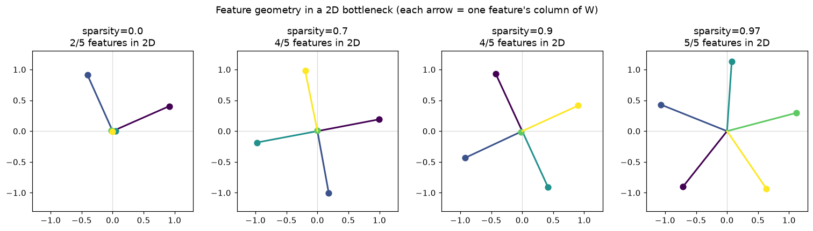
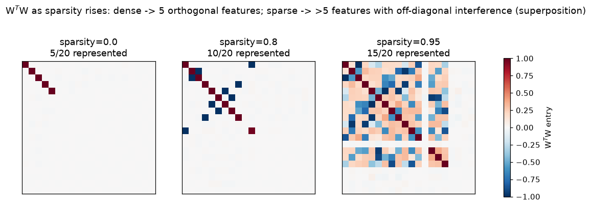
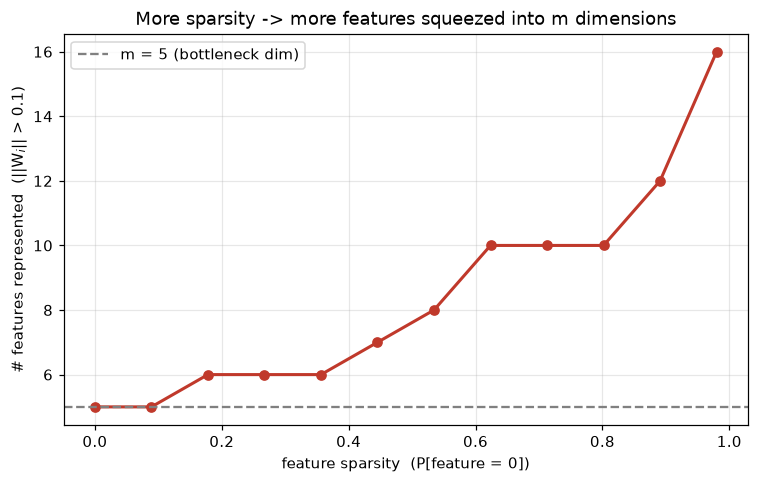

# Toy Models of Superposition

**Superposition** = a network represents *more features than it has dimensions*
by storing them as non-orthogonal directions that overlap. It's the leading
explanation for why neurons are often **polysemantic** (fire for unrelated
concepts) and a core motivation for dictionary learning / SAEs in
interpretability. From Anthropic's [*Toy Models of Superposition*](https://transformer-circuits.pub/2022/toy_model/index.html) (2022).

## The setup

Squeeze `n` features through an `m`-dim bottleneck (`m < n`) and reconstruct
them, with **tied weights**:

```
h   = W x                 # (m,)  compress   — W is (m, n)
x'  = ReLU(Wᵀ h + b)      # (n,)  decompress
L   = Σ_i  I_i (x_i − x'_i)²      # importance-weighted reconstruction error
```

Two ingredients drive everything:

- **Sparsity** — each feature is 0 most of the time (prob `S`), else `U[0,1]`.
  Real-world features are extremely sparse (any given input has few active
  concepts).
- **Importance** `I_i` — features aren't equally worth representing.

## The key idea: sparsity buys superposition

If two rarely-active features share a direction, they *collide* (both on at
once) only rarely, so the reconstruction cost of the collision is small
compared to the benefit of representing an extra feature at all. The sparser the
features, the more the model is willing to pack in.

- **Dense** (`S → 0`): collisions constant → only worth storing the `m` most
  important features, as an **orthogonal** basis. The rest are dropped
  (`||W_i|| → 0`).
- **Sparse** (`S → 1`): collisions rare → store **> m** features at
  **non-orthogonal** angles. That's superposition.

## Feature geometry (2D bottleneck)

Train `m = 2`, `n = 5`, equal importance. Each arrow is one feature's column of
`W`. Dense → 2 orthogonal features (rest collapse to 0). Sparser → the model
adds features as a **regular polygon** (antipodal pair → square → pentagon),
which spreads out interference as evenly as possible.



Not a coincidence: uniform features minimize interference by sitting at maximally
equal angles. Anthropic show these settle into structured arrangements (digons,
triangles, pentagons, and higher-dim analogues like tetrahedra) — sometimes as
"sticky" discrete configurations reminiscent of Thomson-problem packings.

## Interference: read it off WᵀW

`WᵀW` is `n × n`. Diagonal `= ||W_i||²` (how strongly feature *i* is stored);
off-diagonal `= W_i·W_j` (interference between *i* and *j*). Orthogonal storage
→ diagonal-only. Superposition → off-diagonal structure appears.



Dense (left): a clean 5×5 identity block — the 5 most important features, stored
orthogonally, everything else zero. As sparsity rises, more features light up on
the diagonal *and* off-diagonal interference terms fill in.

## Phase transition

Count features with `||W_i|| > 0.1` vs sparsity (`m = 5`, `n = 20`). Flat at
`m = 5` when dense, then climbs well past `m` as features get sparser.



## Why it matters

- **Polysemanticity explained**: a single neuron/direction encodes several
  features because features are in superposition, not axis-aligned.
- **Interpretability**: you can't just read features off neurons. **Sparse
  autoencoders (SAEs)** try to *undo* superposition — overcomplete dictionaries
  that recover the underlying sparse features from the dense activations.
- **Computation in superposition**: models don't just *store* features this way;
  Anthropic show toy models can also *compute* (e.g. compute abs value on) more
  features than they have neurons.

## Code

- `toy_model.py` — the model + manual-gradient Adam training loop (pure NumPy).
- `plots.py` — regenerates the three figures above.

```
uv run python topics/superposition/toy_model.py   # train one model, print feature norms
uv run python topics/superposition/plots.py       # regenerate geometry/gram/phase PNGs
```
